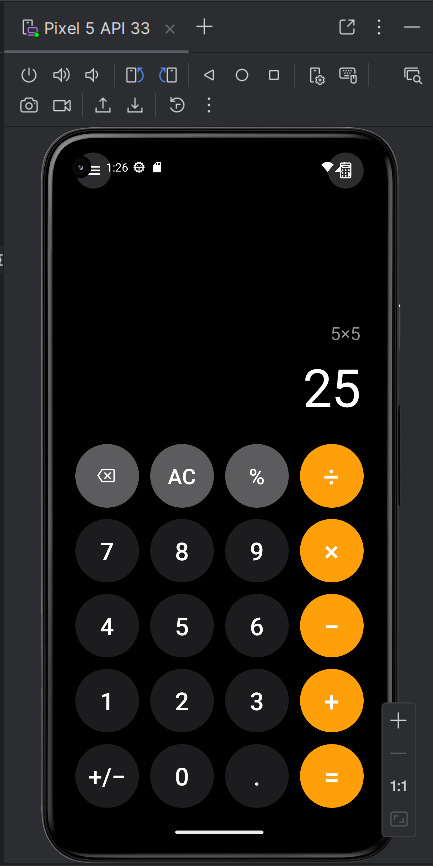

# Calculator App

A simple **iOS-style calculator** built with **Expo** and **React Native**, with a dark theme, large circular keys, and a two-line display (expression preview plus main readout).

## Screenshots



*Dark-themed keypad on Android: grey expression line (e.g. `5×5`), large white result (`25`), utility row (backspace, AC, %), number keys, and orange operator column.*

## Additional documentation

- [Discovery Log – Calculator App Setup.pdf](./Discovery%20Log%20-%20Calculator%20App%20Setup.pdf) — setup / discovery notes for this project (same folder as this README).

## Features

- **Digits 0–9** and a **decimal point**; **four operations** (+, −, ×, ÷) and **equals**
- **AC** resets the calculator; **backspace** removes the last digit of the current entry
- **%** divides the current display value by 100; **+/−** toggles the sign of the current entry
- **Expression line** shows the in-progress operation (with grouped thousands where applicable); after **=**, it shows the full expression while the main line shows the result
- **Chained operations** with evaluation when you press the next operator or equals
- **Divide by zero** shows `Error`; entering a **new digit** after an error starts a fresh calculation
- **Responsive layout**: key size derives from screen width; touch-friendly circular buttons

## Getting started

### Prerequisites

- **Node.js** and **npm**
- For Android: **Android Studio** (emulator) and/or a **physical device** with USB debugging, plus the Android SDK

### Install

```bash
cd calculator_app
npm install
```

### Run

- **Metro / dev server** (Expo Go or dev client):

  ```bash
  npx expo start
  ```

- **Native Android build and install** (uses the `android/` project):

  ```bash
  npx expo run:android
  ```

  This project has been run successfully on an Android emulator with the above command.

## Development notes

- The app is an **Expo-managed** React Native project (see `app.json` and `package.json`).
- The **Android SDK location** on your machine is set in `android/local.properties` via `sdk.dir=...` (this file is machine-specific and is usually not committed to version control).

## Project structure

| Path | Role |
|------|------|
| `App.tsx` | UI: header, display, keypad, styles; wires presses to calculator logic |
| `src/calculatorLogic.ts` | Pure state transitions: digits, operators, equals, AC, backspace, %, sign toggle, expression line, errors |
| `index.ts` | Registers the root component with Expo |
| `app.json` | Expo config (name, icons, splash, Android/iOS settings) |
| `assets/` | App icon, splash, and other static images |
| `android/` | Native Android project (Gradle, manifests) for `expo run:android` |
| `docs/` | Documentation assets (e.g. screenshot for this README) |
| `Discovery Log - Calculator App Setup.pdf` | Discovery / setup log (PDF, next to this README) |

## License

License: **TBD**
